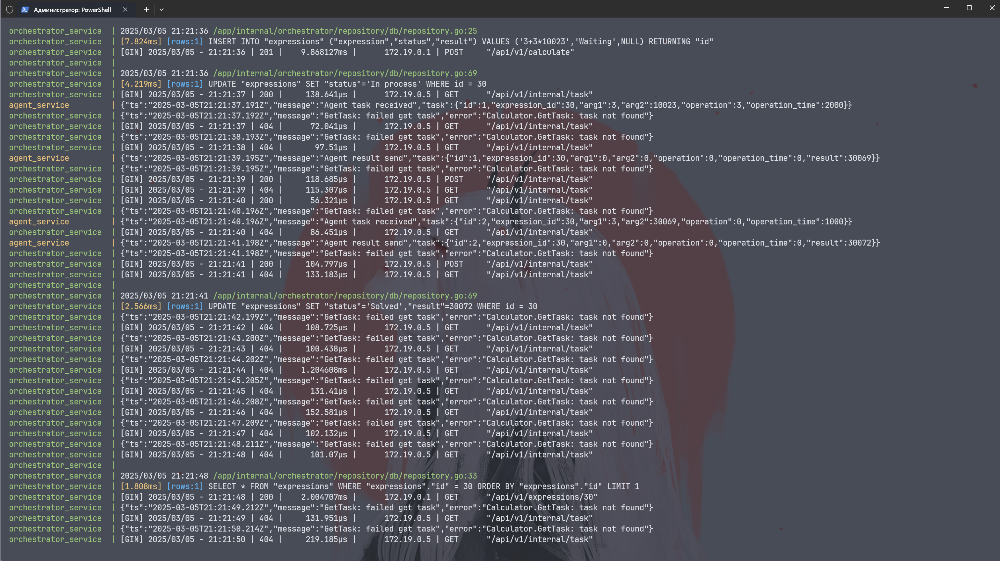

<div align="center">
  
  <h1>Распределённый вычислитель арифметических выражений</h1>

  <p>Распределительный сервис вычисления арифметических выражений позволяет пользователям отправлять арифметические выражения по HTTP и получать результаты их вычислений.</p>

<!-- Badges -->
<p>
  <a href="https://github.com/Qu1nel/YaLyceum-GoProject-CalcWebServiceDistributed/graphs/contributors">
    
  </a>
  <a href="https://github.com/Qu1nel/YaLyceum-GoProject-CalcWebServiceDistributed/commits/main">
    
  </a>
  <a href="https://github.com/Qu1nel/YaLyceum-GoProject-CalcWebServiceDistributed/network/members">
    
  </a>
  <a href="https://github.com/Qu1nel/YaLyceum-GoProject-CalcWebServiceDistributed/stargazers">
    
  </a>
  <a href="https://github.com/Qu1nel/YaLyceum-GoProject-CalcWebServiceDistributed/issues/">
    
  </a>
</p>

<p>
  <a href="https://go.dev/doc/install" >
    
  <a>
  <a href="https://github.com/Qu1nel/YaLyceum-GoProject-CalcWebServiceDistributed/blob/main/LICENSE">
    
  </a>
</p>

<h4>
  <a href="#screenshots">Просмотреть демо</a>
  <span> · </span>
  <a href="#документация">Документация</a>
  <span> · </span>
  <a href="https://github.com/Qu1nel/YaLyceum-GoProject-CalcWebServiceDistributed/issues/">Сообщить о баге</a>
  <span> · </span>
  <a href="https://github.com/Qu1nel/YaLyceum-GoProject-CalcWebServiceDistributed/issues/">Предложить функционал</a>
</h4>
</div>

<br />

<!-- Table of Contents -->

# Содержание

- [О проекте](#о-проекте)
- [Особенности](#особенности)
  - [Скриншоты](#screenshots)
- [Установка](#установка)
- [Инструкция по запуску](#подробная-инструкция-по-запуску-проекта)
  - [Установка Docker](#1-установите-docker)
  - [Настройка переменных окружения](#2-настройте-переменные-окружения)
  - [Запуск с помощью Docker Compose](#3-запустите-проект-с-помощью-docker-compose)
  - [Проверка работоспособности](#4-проверка-работы)
  - [Начало работы с сервисом](#5-начало-работы-с-сервисом)
  - [Остановка сервиса](#6-остановка-проекта)
  - [Дополнительные команды](#7-дополнительные-команды)
- [Тестирование](#тестирование)
- [Начало работы](#начало-работы)
  - [Веб интерфейс](#веб-интерфейс)
    - [Возможности интерфейса](#что-доступно-в-веб-интерфейсе)
  - [Curl](#curl)
    - [Создание выражения](#создать-выражение)
    - [Инструкции по работе с API](#инструкции-по-работе-с-api)
  - [Postman](#postman)
- [Документация](#документация)
- [Разработчики](#разработчики)
- [Связь](#связь)
- [Лицензия](#лицензия)

## О проекте

Проект "Сервис подсчёта арифметических выражений" представляет собой распределённую систему для вычисления арифметических выражений, которая позволяет эффективно обрабатывать сложные вычисления, требующие значительных вычислительных ресурсов. Система разработана на языке Go и использует архитектуру, которая позволяет масштабировать вычислительные мощности путём добавления новых машин.

Сервис строится на основе ранее реализованной программы, которая уже обладала функциональностью для вычисления выражений, и расширяет её, предлагая удобный интерфейс для взаимодействия. Благодаря гибкости веб-приложения, пользователи могут использовать его из различных устройств и платформ.

## Особенности

1. Асинхронная обработка выражений: Пользователь отправляет арифметическое выражение (например, 2 + 2 * 2), и система начинает его вычисление. Результат не возвращается сразу, так как вычисления могут занимать значительное время.

2. Распределённые вычисления: Каждая арифметическая операция (сложение, вычитание, умножение, деление) выполняется на отдельной "машине". Это позволяет параллельно вычислять части выражения, что ускоряет процесс.

3. Масштабируемость: Система может быть легко масштабирована путём добавления новых вычислительных узлов, что позволяет обрабатывать больше выражений и увеличивать производительность.

4. Проверка статуса вычислений: Пользователь может периодически запрашивать статус вычисления своего выражения. Когда результат будет готов, он получит его в ответ на запрос.

5. Сервис предоставляет удобный **веб-интерфейс** для взаимодействия с API, аналогичный **Swagger UI**. Веб-интерфейс позволяет:

- **Отправлять выражения** на вычисление через интуитивно понятную форму.
- **Отслеживать статус** выполнения выражений.
- **Просматривать результаты** вычислений.
- **Изучать документацию API** прямо в браузере, включая доступные эндпоинты, параметры запросов и примеры использования.

Для проекта доступен веб-интерфейс. Он упрощает тестирование и взаимодействие с API, делая процесс вычисления выражений более наглядным и удобным для пользователей.

Механизм вычислений основан на [алгоритме Shunting yard](https://en.wikipedia.org/wiki/Shunting_yard_algorithm), который поддерживает следующие элементы выражений:

- **Цифры**: `0`–`9`
- **Операторы**: `*` (умножение), `/` (деление), `+` (сложение), `-` (вычитание), `^` (степень)
- **Скобки и разделители**: `.` (десятичная точка), `,` (разделитель аргументов), `(` и `)` (скобки)
- **Функции**: 
  - `log(a, x)` — логарифм числа `x` по основанию `a`
  - `sqrt(a)` — квадратный корень из числа `a`

Приоритет операторов:

| Оператор | Приоритет |
|:--------:|:---------:|
| `^`      | 5         |
| `-` (унарный) | 4    |
| `*`      | 3         |
| `/`      | 3         |
| `+`      | 2         |
| `-` (бинарный) | 2   |

Так же сервер позволяет корректно обрабатывать сложные выражения с учётом приоритетов операторов и скобок.

<details>
  <summary><h3 id="screenshots">Скриншоты</h3></summary>
  <div align="center">
    <div>
      
    </div>
    <div>
      
    </div>
    <div>
      
    </div>
    <div>
      
    </div>
  </div>
</details>

## Установка

Склонируйте репозиторий или скачайте `.zip` архив и раскакуйте его

```bash
git clone https://github.com/Qu1nel/YaLyceum-GoProject-CalcWebServiceDistributed.git
cd YaLyceum-GoProject-CalcWebServiceDistributed/
```

## Подробная инструкция по запуску проекта

#### 1. Установите Docker

Для работы с проектом необходимо установить Docker. Если у вас его ещё нет, следуйте официальной инструкции:  

[Установка Docker Desktop](https://docs.docker.com/get-started/introduction/get-docker-desktop/).

После установки убедитесь, что Docker Desktop запущен.

#### 2. Настройте переменные окружения

Перед запуском проекта необходимо настроить переменные окружения. Для этого:

1. Откройте файл `config.env` в текстовом редакторе.

2. Заполните переменные в соответствии с требованиями проекта. Оптимальное содержимого файла:

```env
SERVER_PORT=8989
SERVER_HOST=service_orchest
POSTGRES_USER=root
POSTGRES_PASSWORD=123
POSTGRES_DB=vi_database
POSTGRES_PORT=5432
POSTGRES_HOST=postgres
TIME_ADDITION_MS=1000ms
TIME_SUBTRACTION_MS=1000ms
TME_MULTIPLICATION_MS=1000ms
TIME_DIVISION_MS=1000ms
TIME_EXPONENTIATION_MS=1000ms
TIME_UNARY_MINUS_MS=1000ms
TIME_LOGARITHM_MS=1000ms
TIME_SQUARE_ROOT_MS=1000ms
COMPUTING_POWER=50
```

3. Сохраните изменения в файле.

#### 3. Запустите проект с помощью Docker Compose

1. Откройте терминал (рекомендуется использовать **Git Bash** на Windows или стандартный терминал на Linux/macOS).
2. Убедитесь, что Docker Desktop запущен.
3. Перейдите в директорию проекта, где находится файл `docker-compose.yml`.
4. Выполните команду для запуска контейнеров:

```bash
docker-compose up -d
```

Флаг `-d` запускает контейнеры в фоновом режиме. Уберите его, если хотите видеть логи.

#### 4. Проверка работы

После выполнения команды `docker-compose up -d` контейнеры начнут запускаться. Вы можете проверить статус контейнеров с помощью команды:

```bash
docker-compose ps
```

Убедитесь, что все сервисы запущены и работают корректно.

#### 5. Начало работы с сервисом

После успешного запуска вы можете начать взаимодействие с сервисом одним из двух способов:

1. **Через веб-интерфейс**:  
   Откройте браузер и перейдите по адресу:  
   [http://localhost:8085/](http://localhost:8085/)  
   Веб-интерфейс предоставляет удобный способ отправки выражений и отслеживания их статуса.

2. **Через команды `curl`**:  
   Если вы предпочитаете работать через терминал, вы можете использовать команды `curl` для отправки запросов к API. Примеры запросов приведены ниже в инструкции.

3. **Через утилиту `Postman`**:
   Если вы запускаете проект через `VS Code`, то у вас есть возможность воспользовать утилитой `Postman`, которая представляет из себя интерактивную оболочку взаимодействия с web-сервисом с помощью запросов к серверу. Работает прямо из редактора, как расширение.

Подробнее об этом написано в разделе [Документация](#документация).

#### 6. Остановка проекта

Чтобы остановить контейнеры, выполните команду:

```bash
docker-compose down
```

#### 7. Дополнительные команды

- **Просмотр логов**: Чтобы увидеть логи работы контейнеров, используйте команду:
  ```bash
  docker-compose logs -f
  ```
- **Пересборка контейнеров**: Если вы внесли изменения в код или конфигурацию, пересоберите контейнеры:
  ```bash
  docker-compose up -d --build
  ```

## Тестирование

Тесты запускаются автоматически при старте системы, но их также можно запустить вручную с помощью команды **после запуска сервиса**, так как для работы тестов требуется подключение к базе данных. Для запуска тестов введите следующую команду:

```bash
go test ./internal/tests/e2e_test.go -timeout 120s -v -cover -coverpkg ./... -coverprofile coverage.out
```

После выполнения тестов будет создан файл `coverage.out`, который содержит информацию о покрытии кода тестами. Чтобы просмотреть результаты в удобном формате, используйте команду:

```bash
go tool cover -html=coverage.out
```

Тестирование выполняется в среде **Docker Compose**, что обеспечивает изолированное окружение для проверки работы системы.

## Начало работы

### Веб интерфейс

После успешного запуска проекта вы можете взаимодействовать с сервисом через удобный **веб-интерфейс**. Для этого откройте браузер и перейдите по адресу:

[http://localhost:8085/](http://localhost:8085/)

#### Что доступно в веб-интерфейсе:

1. **Отправка выражений**:  
   Вы можете вводить арифметические выражения прямо в интерфейсе и отправлять их на вычисление.

2. **Отслеживание статуса**:  
   В интерфейсе отображается статус выполнения выражений, а также результаты вычислений или ошибки, если они возникли.

3. **Интерактивное тестирование**:  
   Веб-интерфейс позволяет тестировать API прямо в браузере, отправляя запросы и просматривая ответы в реальном времени.

Этот инструмент значительно упрощает работу с сервисом, делая её более наглядной и удобной. Если вы предпочитаете работать через терминал, вы также можете использовать команды `curl`, как описано в инструкции ниже.

### Curl

Вводить запросы следует не в **cmd** или **PowerShell**, а в **Git Bash** (если вы устанавливали Git на свой компьютер, то Git Bash уже должен быть доступен). Это связано с тем, что в **cmd** и **PowerShell** требуется экранировать специальные символы, например, `^`. В результате чтение и написание выражений становится значительно сложнее. Git Bash позволяет избежать этих проблем, делая процесс более удобным и понятным.

#### Создать выражение

Шаблон запроса на создание выражения, вставьте в него выражение и вставьте в `Git Bash`.

**ВАЖНО!**: в своём выражении уберите `{` и `}`. Так же выражение не должно содержать пробелы.

```bash
curl -X 'POST' -w "%{http_code}"\
'http://localhost:8989/api/v1/calculate' \
-H 'Content-Type: application/json' \
-d '{
  "expression": "{вставьте сюда выражение}"
}'
```

|                Пример выражения                  |   КОД  |          Статус          |  Результат |
|:------------------------------------------------:|:------:|:------------------------:|:----------:|
|                     `2+2*2`                      |  201   |          Solved          |     6      |
|             `log(sqrt(4),sqrt(64))`              |  201   |          Solved          |     3      |
|      `log(sqrt(4),sqrt(64))^sqrt(81)*(-1)`       |  201   |          Solved          |   -19683   |
|  `log(18,18)^(-9)/3.14*(-12-3)*3/10+2*sqrt(4)`   |  201   |          Solved          |  2.56689   |
| `log(18,18)^(-9)/3.14*(-12-3)*3/(-10)+2*sqrt(4)` |  201   |          Solved          |  5.43311   |
|                    `log(-2,8`                    |  201   | Unprocessable expression |     -      |
|                    `log(1,8)`                    |  201   | Unprocessable expression |     -      |
|                  `log(16,(-1))`                  |  201   | Unprocessable expression |     -      |
|                 `sqrt(50-50-50)`                 |  201   | Unprocessable expression |     -      |
|            `log(sqrt(4),sqrt(64))/0`             |  201   | Unprocessable expression |     -      |
|           `1-1)*log(sqrt(4),sqrt(64))`           |  201   | Unprocessable expression |     -      |
|                     `empty`                      |  422   |            -             |     -      |
|                      `0&0`                       |  422   |            -             |     -      |
|                      `2*2*`                      |  422   |            -             |     -      |
|                      `1+1*`                      |  422   |            -             |     -      |
|                     `2+2**2`                     |  422   |            -             |     -      |
|                     `2+2)-2`                     |  422   |            -             |     -      |
|                   `((2+2-*(2`                    |  422   |            -             |     -      |
|              `log(sqrt(4),sqrt(64)`              |  422   |            -             |     -      |
|       `log(sqrt(4),sqrt(64))^sqrt(81)*-1`        |  422   |            -             |     -      |

#### Инструкции по работе с API

##### 1. Получить список выражений с пагинацией

Используйте следующий шаблон запроса, чтобы получить список выражений с пагинацией. Вставьте вместо `{size}` количество выражений на странице, а вместо `{page}` — номер страницы (нумерация начинается с 0). Затем отправьте запрос в **Git Bash**:
```bash
curl -X 'GET' \
  'http://localhost:8989/api/v1/expressions?size={size}&page={page}' \
  -H 'accept: application/json'
```

##### 2. Получить выражение по его ID
Чтобы получить выражение по его уникальному идентификатору, используйте этот шаблон запроса. Вставьте вместо `{id}` ID выражения и отправьте запрос в **Git Bash**:
```bash
curl -X 'GET' \
  'http://localhost:8989/api/v1/expressions/{id}' \
  -H 'accept: application/json'
```

##### 3. Получить задачу для вычисления
Для получения задачи, которую необходимо вычислить, отправьте следующий запрос в **Git Bash**:
```bash
curl -X 'GET' \
  'http://localhost:8989/api/v1/internal/task' \
  -H 'accept: application/json'
```

##### 4. Отправить результат вычисления
Чтобы отправить результат вычисления задачи, используйте этот шаблон запроса. Вставьте либо `result` (числовой результат), либо `error` (текст ошибки, если вычисление не удалось). Затем отправьте запрос в **Git Bash**:
```bash
curl -X 'POST' \
  'http://localhost:8989/api/v1/internal/task' \
  -H 'accept: */*' \
  -H 'Content-Type: application/json' \
  -d '{
  "id": 1,
  "expression_id": 1,
  "result": {вставьте число},
  "error": "{вставьте текст ошибки}"
}'
```

### Postman

Так же можно использовать `Postman` в самой IDE. Если вы пользуетесь `VS Code`, то нужно просто зайти в `extention` в `VS Code`, ввести `Postman` и установить первое расширение из списка. Чтобы пользоваться `Postman` нужно в нем зарегистрироваться. После регистрации нужно зайти в свой аккаунт в расширении для `VS Code`. И все, можно создавать запросы нажатием на `NewHTTPRequest`. Потом выбрать метод, ввести `localhost:8989/api/v1/calculate` в поле `URL`. Если вы хотите проверить правильность вычислений то выбранный метод должен быть `POST` и  во вкладке `body` выбрать `raw`, а потом справа нажав на синюю стрелочку выбрать `json`. Туда нужно вставить струтуру

```json
{  
    "expression":"{ваше выражение}"
}  
```

После этого в нижнем окне вы увидите ответ от сервера в `json` формате.

## Документация

Ниже описано первое изображение, на котором отображены основные сущности и их связи.

<div align="center">
  <div>
    
  </div>
</div>

На схеме показаны следующие элементы:

1. **AGENT_SERVICE**:
   - `agent`: Сервис агента, отвечающий за выполнение задач.

2. **ORCHESTRATOR_SERVICE**:
   - `orchestrator`: Основной сервис-оркестратор, управляющий работой системы.
   - `service_started`: Указание на запуск сервиса.
   - `backend-network`: Связь с бэкенд-сетью.
   - `postgres_container`: Контейнер с базой данных PostgreSQL.

3. **BACKEND NETWORK**:
   - `service_healthy`: Состояние сервисов, указывающее на их корректную работу.

4. **TEST NETWORK**:
   - `tests`: Тестовая среда для проверки работы системы.
   - `service_completed_successfully`: Указание на успешное завершение работы сервиса.

5. **swagger-ui**: Веб-интерфейс для взаимодействия с API системы.

## Разработчики

- [Qu1nel](https://github.com/Qu1nel)

## Связь

Мой телеграм для связи: [`@qnllnq`](https://t.me/qnllnq)

## Лицензия

[MIT](./LICENSE) © [Ivan Kovach](https://github.com/Qu1nel/)
