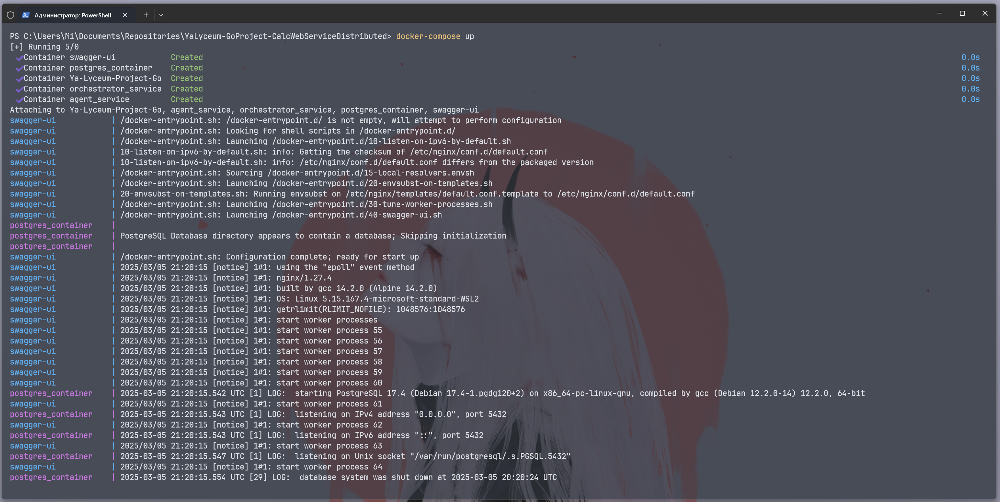
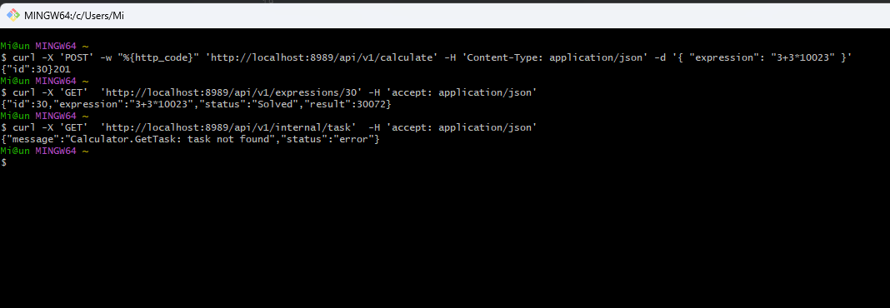

<div align="center">
  
  <h1>Распределённый вычислитель арифметических выражений</h1>

  <p>Распределительный сервис вычисления арифметических выражений позволяет пользователям отправлять арифметические выражения по HTTP и получать результаты их вычислений.</p>

<!-- Badges -->
<p>
  <a href="https://github.com/Qu1nel/YaLyceum-GoProject-CalcWebServiceDistributed/graphs/contributors">
    
  </a>
  <a href="https://github.com/Qu1nel/YaLyceum-GoProject-CalcWebServiceDistributed/commits/main">
    
  </a>
  <a href="https://github.com/Qu1nel/YaLyceum-GoProject-CalcWebServiceDistributed/network/members">
    
  </a>
  <a href="https://github.com/Qu1nel/YaLyceum-GoProject-CalcWebServiceDistributed/stargazers">
    
  </a>
  <a href="https://github.com/Qu1nel/YaLyceum-GoProject-CalcWebServiceDistributed/issues/">
    
  </a>
</p>

<p>
  <a href="https://go.dev/doc/install" >
    
  <a>
  <a href="https://github.com/Qu1nel/YaLyceum-GoProject-CalcWebServiceDistributed/blob/main/LICENSE">
    
  </a>
</p>

<h4>
  <a href="#screenshots">Просмотреть демо</a>
  <span> · </span>
  <a href="#документация">Документация</a>
  <span> · </span>
  <a href="https://github.com/Qu1nel/YaLyceum-GoProject-CalcWebServiceDistributed/issues/">Сообщить о баге</a>
  <span> · </span>
  <a href="https://github.com/Qu1nel/YaLyceum-GoProject-CalcWebServiceDistributed/issues/">Предложить функционал</a>
</h4>
</div>

<br />

<!-- Table of Contents -->

# Содержание

- [О проекте](#о-проекте)
  - [Скриншоты](#screenshots)
- [Установка](#установка)
- [Запуск](#запуск)
  - [Make](#make)
  - [Docker](#docker)
  - [Самостоятельно](#самостоятельно)
- [Тестирование](#тестирование)
  - [Make](#make-1)
  - [Вручную](#вручную)
- [Документация](#документация)
  - [Postman](#postman)
  - [Curl](#curl)
  - [Swagger-UI](#swagger-ui)
- [Разработчики](#разработчики)
- [Связь](#связь)
- [Лицензия](#лицензия)

## О проекте

Проект "Сервис подсчёта арифметических выражений" представляет собой веб-приложение, которое позволяет пользователям легко и быстро вычислять арифметические выражения. Пользователь отправляет арифметическое выражение через HTTP-запрос, и в ответ он получает результат вычисления. 

Сервис строится на основе ранее реализованной программы, которая уже обладала функциональностью для вычисления выражений, и расширяет её, предлагая удобный интерфейс для взаимодействия. Благодаря гибкости веб-приложения, пользователи могут использовать его из различных устройств и платформ. Этот проект способствует улучшению математических вычислений и делает их доступнее для широкой аудитории.

<details>
  <summary><h3 id="screenshots">Скриншоты</h3></summary>
  <div align="center">
    <div>
      
    </div>
    <div>
      
    </div>
    <div>
      
    </div>
  </div>
</details>

## Установка

Склонируйте репозиторий или скачайте `.zip` архив и раскакуйте его

```bash
git clone https://github.com/Qu1nel/YaLyceum-GoProject-CalcWebServiceDistributed.git
cd YaLyceum-GoProject-CalcWebServiceDistributed/
```

## Запуск

Для запуска сервиса нужен [docker](https://docs.docker.com/compose/install/), либо [make](https://stackoverflow.com/questions/32127524/how-to-install-and-use-make-in-windows) или просто ***запустить сервис самостоятельно***

### Make

Если у вас есть `make`, то вы можете использовать команду:

```bash
make run
```

Или если вы хотите собрать приложение и запустить:

```bash
make build
make build-run
```

`make help` для получения информации о дополнительных командах

### Docker


Если у вас установлен [docker](https://docs.docker.com/compose/install/), то запустите `Docker Desktop` и введите команду в терминал `VS Code`:

```bash
docker-compose up -d
```

Все ответы сервера будут записывать в логи образа, которые можно посмотреть в `Docker Desktop` нажав на calc_service. Чтобы остановить сервер нужно ввести в терминал `VS Code`:

```bash
docker compose down
```

После откройте браузер и напишите в адрессную строку `http://localhost:8085`, у вас откроется swagger-ui


### Самостоятельно

Для самостоятельного запуска сервиса, запустите:

```bash
go mod tidy
go build -o main ./cmd/main.go
./main
```

Или без сборки:

```bash
go mod tidy
go run ./cmd/main.go
```

## Тестирование

Тесты написаны для `calculator` и `server` файлов и для запуска тестов можно воспользовать утилитой `make`, либо запустить их самостоятельно

## Make

Если у вас установлена утилина `make`, то вы можете запустить тесты так:

```bash
make test
```

Или:

```bash
make tests
```

## Вручную

Для запуска тестов вручную нужно ввести в терминал:

```bash
go test ./pkg/calculator/ -short -v -cover
go test ./internal/server/ -short -v -cover
```

## Документация

Для остановки сервера нажмина на сочетание клавиш: `<CTRL-C>`

### Postman

Так же можно использовать `Postman` в самой IDE. Если вы пользуетесь `VS Code`, то нужно просто зайти в `extention` в `VS Code`, ввести `Postman` и установить первое расширение из списка. Чтобы пользоваться `Postman` нужно в нем зарегистрироваться. После регистрации нужно зайти в свой аккаунт в расширении для `VS Code`. И все, можно создавать запросы нажатием на `NewHTTPRequest`. Потом выбрать метод, ввести `localhost:8989/api/v1/calculate` в поле `URL`. Если вы хотите проверить правильность вычислений то выбранный метод должен быть `POST` и  во вкладке `body` выбрать `raw`, а потом справа нажав на синюю стрелочку выбрать `json`. Туда нужно вставить струтуру

```json
{  
    "expression":"ваше выражение"  
}  
```

После этого в нижнем окне вы увидите ответ от сервера в `json` формате.

### Curl

Введите команду: (для Internal server error - 500)

```bash
curl -w "%{http_code}" --location 'localhost:8989/api/v1/calculate' \
--header 'Content-Type: application/json' \
--data '{
  "expression": "internal"
}'
```

**Ожидаемый ответ:**

```json
{
   "error":"Internal server error"
}
```
```bash
500
```

Введите команду: (для успешного выполшения - 200)

```bash
curl -w "%{http_code}" --location 'localhost:8989/api/v1/calculate' \
--header 'Content-Type: application/json' \
--data '{
  "expression": "2+2*2"
}'
```

**Ожидаемый ответ:**

```json
{
   "result": "6"
}
```
```bash
200
```

Введите команду: (для неккоректного выражения - 422 Expression is not valid (пояснение ошибки))

```bash
curl -w "%{http_code}" --location 'localhost:8989/api/v1/calculate' \
--header 'Content-Type: application/json' \
--data '{
  "expression": ""
}'
```

**Ожидаемый ответ:**

```json
{
   "error": "Expression is not valid (empty expression)"
}
```
```bash
422
```

### Swagger-UI

Если вы умеете использовать `docker`, то можно использовать [swagger-ui](https://en.wikipedia.org/wiki/Swagger_(software)), там будет удобный интерфейс для создания своих запросов.


## Разработчики

- [Qu1nel](https://github.com/Qu1nel)

## Связь

Мой телеграм для связи: [`@qnllnq`](https://t.me/qnllnq)

## Лицензия

[MIT](./LICENSE) © [Ivan Kovach](https://github.com/Qu1nel/)
